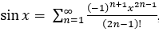

# lab2_16

## Лабораторная работа 2. Вариант 16.

На примере выполнения простой вычислительной задачи, вычисления синуса угла, смоделировать работу вычислительной системы, которая имеет один ведущий узел и несколько ведомых. Связь между ведомым и ведущими узлами осуществляется с помощью пар однонаправленных очередей.

Для заданного диапазона углов (в градусах) с шагом в 1 градус необходимо составить таблицу значений синуса (массив структур). Вводится количество ведомых узлов, диапазон углов, точность, диапазон количества членов ряда в разложении.

Пример ввода: `3 0 90 0.0001 5 8`.

На каждом шаге выполнения программы с вероятностью 75% могут последовательно происходить следующие события (проверка вероятности наступления событий в п.1 – п.3 осуществляется для каждой очереди отдельно):

1) Ведущий узел помещает задания (значение угла; случайное количество членов ряда из указанного диапазона) для выполнения в очереди ведомых узлов.

2) Ведомые узлы вычитывают задания из своих очередей, вычисляют значение синуса угла при помощи ряда Маклорена:

 , помещают значения вычислений в очереди ведущего узла.

3) Ведущий узел вычитывает результаты выполнения заданий ведомыми узлами и добавляет их в итоговую таблицу.

Вычисления продолжаются до тех пор, пока таблица не будет заполнена целиком.

Очереди для связи между узлами вычислительной системы должны быть представлены с помощью логической структуры данных «очередь».